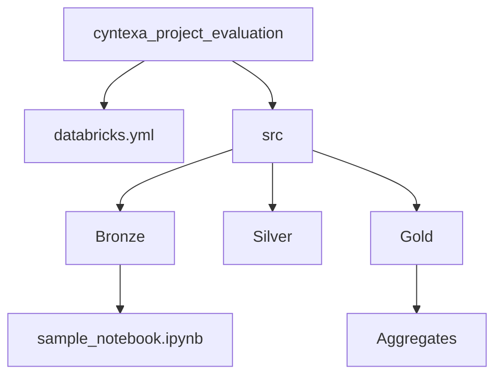

# <!--header-anchor-->
<!-- Animated gradient header (SVG) - dark-mode friendly -->
<div align="center">
  <!-- Inline SVG: gradient + left-to-right reveal (typing-like) -->
  <svg width="820" height="140" viewBox="0 0 820 140" xmlns="http://www.w3.org/2000/svg" role="img" aria-label="Digital Banking ETL">
    <defs>
      <linearGradient id="g" x1="0" x2="1" y1="0" y2="1">
        <stop offset="0%" stop-color="#00d4ff"/>
        <stop offset="50%" stop-color="#7b61ff"/>
        <stop offset="100%" stop-color="#ff6b6b"/>
      </linearGradient>

  </svg>
</div>

---

<!-- Tech badges -->
<p align="center">
  <a href="#project-overview"></a>
  <a href="#tech-stack"></a>
  <a href="#code-structure"></a>
  <a href="#deployment"></a>
  <a href="https://github.com/mohit2820/cyntexa_project_evaluation"></a>
</p>

---

<!-- Interactive Table of Contents -->
## Table of Contents
- [Project Overview](#project-overview) 🔎
- [Architecture (Mermaid Diagram)](#architecture-mermaid-diagram) 🏗️
- [Tech Stack](#tech-stack) 🧰
- [Code Structure](#code-structure) 📁
- [Jobs & Pipeline](#jobs--pipeline) ⚙️
- [Deployment (copy-paste)](#deployment-copy-paste) 🚀
- [How it helps Digital Banking](#how-it-helps-digital-banking) 💡
- [Contributing & Footer](#contributing--footer) ❤️

> Tip: Click any TOC entry to jump to the section. (GitHub anchors supported in all modern browsers.)

---

## Project Overview
<a id="project-overview"></a>

This repository implements the "Digital_Banking_etl" Databricks ETL pipeline as a Cyntexa project evaluation. It follows the Medallion architecture:
- Bronze: raw ingest (low transformation, immutable raw records)
- Silver: cleaned, enriched, conformed datasets
- Gold: business-ready aggregates, KPIs, ML features

Business value:
- Centralized, governed data via Unity Catalog (catalog: `digital_banking`)
- Clear separation between dev/prod schemas for safe promotion
- Scalable serverless Databricks Job orchestration: notebooks, wheel-based tasks, and pipeline refresh triggers
- Fast time-to-insight for product, risk, and compliance teams in digital banking

---

## Architecture (Mermaid Diagram)
<a id="architecture-mermaid-diagram"></a>

```mermaid
flowchart LR
  subgraph Workspace["Databricks Workspace"]
    direction TB
    A[Users / Ingesters] -->|raw events| Bronze[Bronze<br/>src/Bronze]
    Bronze --> Silver[Silver<br/>src/Silver]
    Silver --> Gold[Gold<br/>src/Gold]
    Gold --> BI[BI / ML / Reports]
  end

  style Bronze fill:#b87333,stroke:#8a4a1f,stroke-width:1px,color:#fff
  style Silver fill:#9fb7c8,stroke:#6a90a0,stroke-width:1px,color:#072029
  style Gold fill:#ffd166,stroke:#b58b00,stroke-width:1px,color:#0a0a0a

  subgraph Databricks["Databricks"]
    direction LR
    DB[Unity Catalog: digital_banking] --- Workspace
    Note[Job: sample_job<br/>(notebook → python_wheel → refresh_pipeline)] --- DB
  end
```

Notes:
- Diagram highlights data movement Bronze → Silver → Gold.
- Unity Catalog: `digital_banking` (dev / prod schemas exist in the workspace).

---

## Tech Stack
<a id="tech-stack"></a>

- Platform: Databricks (Unity Catalog)
- Architecture: Medallion (Bronze → Silver → Gold)
- Job orchestration: Databricks Jobs (serverless)
- Asset packaging: Databricks Asset Bundles (databricks.yml)
- Build: uv build --wheel
- Languages: Jupyter Notebook (.ipynb), Python (wheel)
- Code layout: src/Bronze, src/Silver, src/Gold
- Workspace: https://dbc-841ecea8-e2ed.cloud.databricks.com

Badges (hoverable links):
- Databricks: 
- Medallion: 
- Languages:  

---

## Code Structure
<a id="code-structure"></a>

Project tree (top-level important paths):

```text
cyntexa_project_evaluation/
├─ databricks.yml                 # DAB (Databricks Asset Bundle) config
├─ src/
│  ├─ Bronze/
│  │  └─ ingest_notebooks/        # raw ingest notebooks (sample_notebook.ipynb)
│  ├─ Silver/
│  │  └─ transforms/              # cleaning & conformance
│  └─ Gold/
│     └─ aggregates/              # business aggregates & ML features
├─ jobs/
│  └─ sample_job/                 # job definitions (notebooks + wheel)
│      ├─ sample_notebook.ipynb
│      └─ wheel/                  # built wheel artifacts (after uv build --wheel)
└─ README.md
```

Mermaid tree option:



---

## Jobs & Pipeline
<a id="jobs--pipeline"></a>

Pipeline name: `Digital_Banking_etl`  
- Databricks catalog: `digital_banking` (dev / prod schemas)  
- Job: `sample_job` (serverless)

sample_job tasks:
1. notebook_task — runs `sample_notebook.ipynb` (path: `jobs/sample_job/sample_notebook.ipynb`)  
2. python_wheel_task — Python wheel entry point: `main` (depends on notebook_task)  
3. refresh_pipeline — triggers the ETL pipeline refresh (depends on notebook_task)

Databricks Asset Bundles:
- Config file: `databricks.yml` — used to package and deploy notebooks + wheels into the workspace and create jobs.

---

## Deployment (copy-paste)
<a id="deployment-copy-paste"></a>

Production-ready copy-paste commands. Replace placeholders and tokens before running.

1) Build the wheel (from repo root)
```bash
# build wheel
uv build --wheel
# wheel output (example): dist/digital_banking_etl-0.1-py3-none-any.whl
```

2) Set Databricks connection (example)
```bash
export DATABRICKS_HOST="https://dbc-841ecea8-e2ed.cloud.databricks.com"
export DATABRICKS_TOKEN="<YOUR_DATABRICKS_TOKEN>"
```

3) Deploy using Databricks Asset Bundles (exact CLI name may vary; examples shown)
```bash
# Common invocation (replace with the CLI you have installed: databricks bundle | databricks-bundle | databricks bundles)
# Option A (recommended, uses databricks bundle as in this repo):
DATABRICKS_HOST="$DATABRICKS_HOST" DATABRICKS_TOKEN="$DATABRICKS_TOKEN" databricks bundle deploy --config databricks.yml --target dev

# Option B (alternate CLI packaging):
DATABRICKS_HOST="$DATABRICKS_HOST" DATABRICKS_TOKEN="$DATABRICKS_TOKEN" databricks bundles deploy -c databricks.yml --target prod
```

4) Troubleshooting tips:
- If CLI subcommand differs (databricks-bundle / databricks bundles), run `databricks --help` or `databricks bundle --help`.
- Ensure Unity Catalog and target schemas exist: `digital_banking.dev` and `digital_banking.prod`.
- For jobs that use wheel artifacts, confirm wheel path referenced in `databricks.yml` matches `dist/*.whl`.

---

## How it helps Digital Banking
<a id="how-it-helps-digital-banking"></a>

- Faster fraud detection: normalized Gold datasets feed ML models with consistent features.
- Compliance & auditability: Bronze layer preserves raw events for traceability.
- Product analytics: Silver/Gold aggregates deliver near-real-time KPIs for customer journeys.
- Scalable ops: Databricks serverless jobs + Unity Catalog provide governance and cost isolation.

---

## Contributing & Footer
<a id="contributing--footer"></a>

Contributions: pull requests are welcome. Please:
- Run notebooks end-to-end in a dev workspace
- Update databricks.yml if you add jobs or assets
- Add wheel builds to .gitignore if generated locally (keep artifacts out of source)

<!-- Animated wave footer (SVG) -->
<div align="center" style="margin-top: 18px;">
  <svg viewBox="0 0 1200 120" preserveAspectRatio="none" width="100%" height="80" xmlns="http://www.w3.org/2000/svg" role="img" aria-label="wave">
    <defs>
      <linearGradient id="fg" x1="0" x2="1">
        <stop offset="0%" stop-color="#0b1220"/>
        <stop offset="50%" stop-color="#071428"/>
        <stop offset="100%" stop-color="#061226"/>
      </linearGradient>
    </defs>
    <path d="M0,40 C150,120 350,0 600,40 C850,80 1050,10 1200,40 L1200 120 L0 120 Z" fill="url(#fg)">
      <animate attributeName="d" dur="6s" repeatCount="indefinite"
        values="
          M0,40 C150,120 350,0 600,40 C850,80 1050,10 1200,40 L1200 120 L0 120 Z;
          M0,50 C200,0 350,120 600,60 C850,0 1000,110 1200,50 L1200 120 L0 120 Z;
          M0,40 C150,120 350,0 600,40 C850,80 1050,10 1200,40 L1200 120 L0 120 Z" />
    </path>
  </svg>

  <p style="margin-top:-12px;color:#9aa6b2">
    Made with ❤️ for Cyntexa · Workspace: <a href="https://dbc-841ecea8-e2ed.cloud.databricks.com">dbc-841ecea8-e2ed.cloud.databricks.com</a>
    · Pipeline: <code>Digital_Banking_etl</code> · Job: <code>sample_job</code>
  </p>
</div>

---

